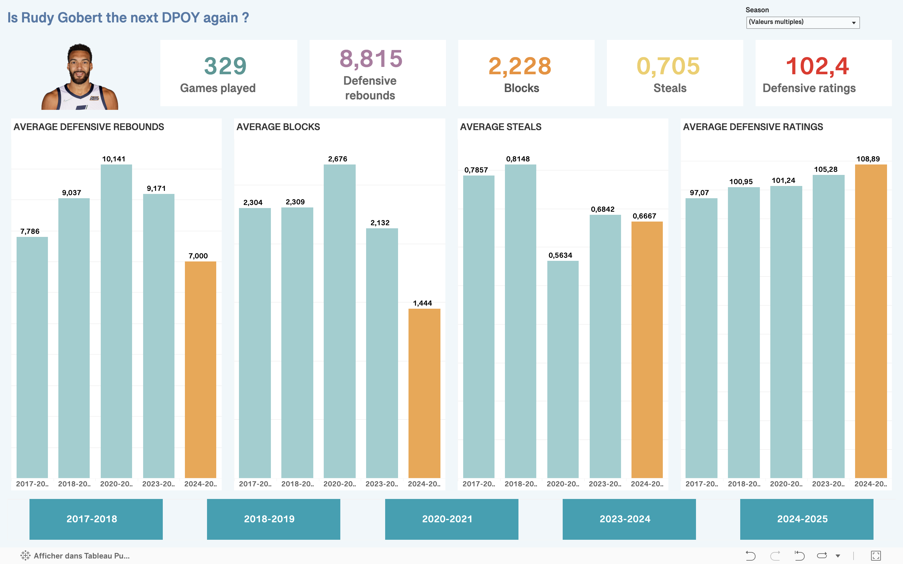

# Rudy Gobert Defensive Statistics Analysis

### **Project Overview**

This project focuses on analyzing and visualizing Rudy Gobert's defensive statistics to gain insights into his impact on the game. The analysis covers key defensive metrics such as blocks, rebounds, and defensive rating.

---

### **Étapes du projet :**

#### 1. **📊 Data Collection :**
The data was sourced from [Basketball Reference](https://www.basketball-reference.com/), a well-known platform providing detailed NBA statistics. The dataset includes:
- Defensive rebounds
- Steals
- Blocks per game
- Defensive rating
- Season
- many other data that are less relevant (date, points, assists...)

#### 2. **⚒️ Data Cleaning & Preprocessing**
The raw data was extracted and cleaned using Python. The preprocessing steps included:

- Data Cleaning – Removed missing values, standardized column names, and handled outliers.

- Feature Engineering – Calculated additional metrics and joining datasets for better insights.

#### 3. **📈 Data Visualization with Tableau**
Once cleaned, the dataset was imported into Tableau for visualization. The final dashboard highlights trends in Gobert’s defensive stats over seasons

---

### **🚀 How to Use This Project**

1. Clone this repository:

   ``git clone https://github.com/dounya-bourhani/NBA_stats_analysis.git``

2. Run the data processing script: 
  
    ``python data_cleaning.py``

3. Open the Tableau dashboard to explore the visualizations [here](https://public.tableau.com/app/profile/dounya.bourhani/viz/rudy_gobert_dpoy/RG_dpoy).

---

### **📩 Contact**
If you have any questions or suggestions, feel free to reach out! 😊
